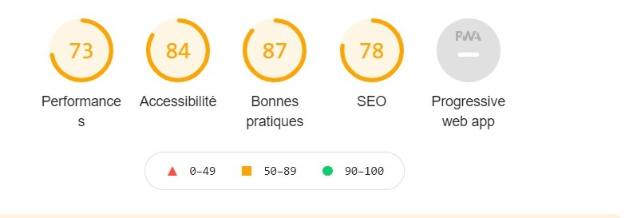
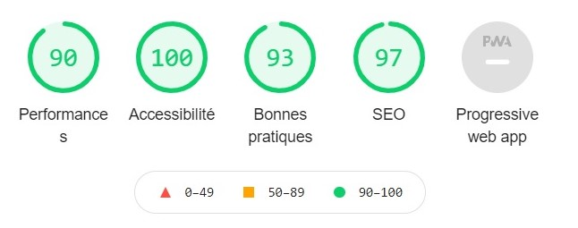

# FORMATION DEVELOPPEUR WEB - OPENCLASSROOMS
## PROJET 4 - OPTIMISER UN SITE WEB EXISTANT

### CONTEXTE :
Optimiser le référencement et l'accessibilité d'un site web existant qui possède un mauvais placement dans les résultats de recherche.

> ### **! ATTENTION !**
> Ce repo contient le code modifié & optimisé du projet. Pour voir le code source du site avant les modifications, suivre ce lien :
> [Github - la chouette agence - code initial](https://github.com/Mary-Clb/PROJET4_LACHOUETTE_INITIAL)

> ### COMPETENCES ACQUISES :
>
> - Apprendre les bases du référencement naturel (mots clés, contenu, autorité du site...)
> - Construire une stratégie SEO
> - Améliorer l'accessibilité du site grâce aux recommandations WCAG
> - Améliorer les performances technique d'un site (affichage, crawlabilité, compression des ressources, utilisation d'outils d'aide à l'audit...)

> ### RESULTATS OBTENUS :
> Analyse avec l'outil Lighthouse du navigateur Google - avant optimisation :  
> 
> 
> 
> Analyse avec l'outil Lighthouse du navigateur Google - après optimisation :  
> 
> 

